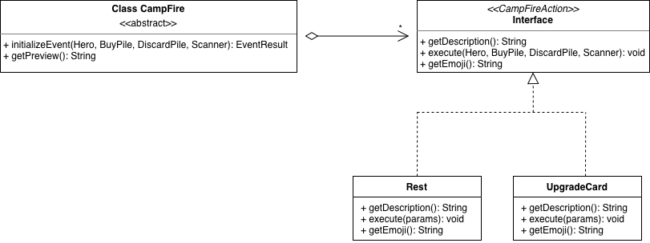
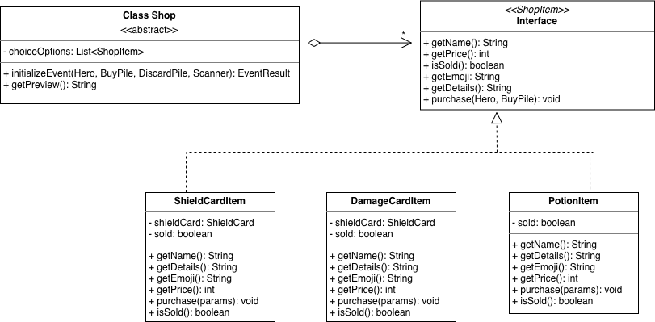
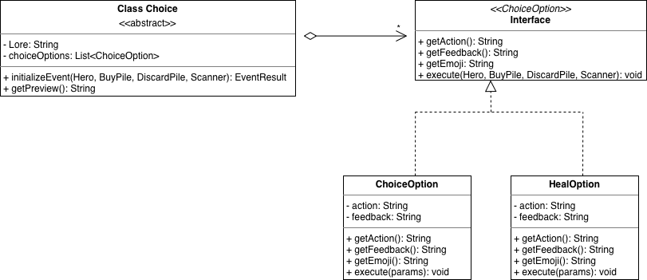
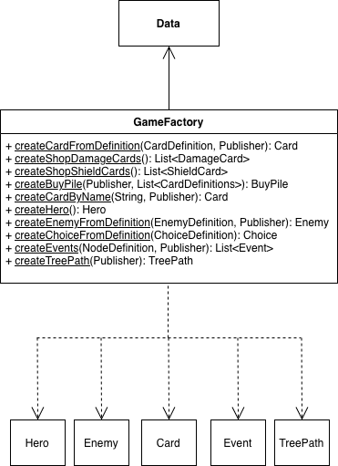

# Roguelike Deckbuilder Computeiros 025

Este projeto é um jogo de batalha em turnos inspirado no roguelike deckbuilder *Slay the Spire*. O jogador controla o herói **Didi Marco**, usando cartas de ataque, defesa e efeitos para derrotar inimigos ao longo de uma sequência de batalhas encadeadas por um mapa de progressão.

---

## Compilação e Execução

A partir da raiz do repositório:

```bash
./gradlew build
./gradlew run
```

O projeto está configurado com Gradle utilizando a estrutura padrão `src/main/java`. A classe principal é `gameOrchestrator.App`, configurada no `build.gradle.kts`.

Para gerar o relatório de cobertura de testes:

```bash
./gradlew test jacocoTestReport
```

O relatório HTML estará em `app/build/reports/jacoco/test/html/index.html`.

---

## Estrutura do Projeto (Gradle)

```
tarefa5/
├──app/
    └── src/
        ├── main/
        │   └── java/
        │       ├── cards/
        │       │   ├── Card.java
        │       │   ├── DamageCard.java
        │       │   ├── ShieldCard.java
        │       │   └── EffectCard.java
        │       ├── deck/
        │       │   ├── Pile.java
        │       │   ├── BuyPile.java
        │       │   ├── DiscardPile.java
        │       │   └── Hand.java
        │       ├── effects/
        │       │   ├── Effect.java
        │       │   ├── Poison.java
        │       │   └── Strength.java
        │       ├── entities/
        │       │   ├── Entity.java
        │       │   ├── Hero.java
        │       │   ├── Enemy.java
        │       │   └── enemies/
        │       │       ├── Azoide.java
        │       │       └── Bzoide.java
        │       ├── events/
        │       │   ├── Event.java
        │       │   ├── Battle.java
        │       │   ├── CampFire.java
        │       │   ├── Choice.java
        │       │   ├── Shop.java
        │       │   ├── campfire/
        │       │   │   ├── CampFireAction.java
        │       │   │   ├── Rest.java
        │       │   │   └── UpgradeCard.java
        │       │   ├── choice/
        │       │   │   ├── ChoiceOption.java
        │       │   │   ├── DamageOption.java
        │       │   │   └── HealOption.java
        │       │   └── shop/
        │       │       ├── ShopItem.java
        │       │       ├── DamageCardItem.java
        │       │       ├── ShieldCardItem.java
        │       │       └── PotionItem.java
        │       ├── gameOrchestrator/
        │       │   ├── App.java
        │       │   ├── Data.java
        │       │   ├── GameFactory.java
        │       │   ├── GameUtils.java
        │       │   ├── SaveManager.java
        │       │   ├── SaveState.java
        │       │   └── UserInterface.java
        │       ├── gamePath/
        │       │   ├── Node.java
        │       │   └── TreePath.java
        │       └── observer/
        │           ├── Publisher.java
        │           └── Subscriber.java
        └── test/
            └── java/
                ├── deck/
                │   ├── BuyPileTest.java
                │   ├── HandTest.java
                │   └── PileTest.java
                ├── effects/
                │   ├── PoisonTest.java
                │   └── StrengthTest.java
                ├── entities/
                │   ├── HeroTest.java
                │   └── enemies/
                │       ├── AzoideTest.java
                │       └── BzoideTest.java
                └── gamePath/
                    └── TreePathTest.java
```

---

### Sistema de Mapa e Progressão

O jogo evoluiu de uma batalha isolada para uma campanha com múltiplas batalhas encadeadas por um mapa de progressão em árvore binária, inspirado no mapa do *Slay the Spire*.

**Como funciona:**

- O mapa é representado pela classe `TreePath`, uma árvore binária construída a partir de `Data.nodeDefinitions` via `GameFactory.createTreePath()`. O elemento central da lista vira a raiz; as metades esquerda e direita formam as subárvores recursivamente.
- Cada nó da árvore (`Node`) contém uma lista de eventos a serem executados em sequência e referências para os próximos nós (esquerda e direita).
- O jogador começa no nó raiz. Após concluir todos os eventos de um nó, escolhe avançar pelo caminho da esquerda ou da direita — sempre em direção a nós mais profundos, sem possibilidade de retroceder.
- Se o nó atual possui apenas um filho, o jogador avança automaticamente, sem necessidade de escolha.
- O jogo termina em **vitória** quando o jogador conclui o nó folha (sem filhos), e em **derrota** quando a vida do herói chega a zero.
- **Vida, ouro e baralho** do herói persistem entre nós. Efeitos e energia são reiniciados a cada nova batalha.

### Sistema de Eventos

Cada nó do mapa contém uma lista de eventos executados em sequência ao ser visitado. Todos os eventos estendem a classe abstrata `Event`, que define o contrato `initializeEvent()` e `getPreview()`.

- **`Battle`** — combate contra inimigos; pode retornar `CONTINUE`, `DEFEAT` ou `QUIT`.
- **`CampFire`** — permite descansar (recuperar 35% de vida) ou forjar uma carta: são apresentadas 3 cartas aleatórias do baralho e a escolhida tem seus atributos melhorados em 35%.



- **`Shop`** — loja com uma carta de dano, uma de escudo e uma poção, compráveis com ouro ganho em batalhas. O jogador pode sair a qualquer momento.



- **`Choice`** — evento narrativo com duas opções embaralhadas, cada uma causando dano ou cura equivalente a 10% da vida máxima.



O padrão **Strategy** é aplicado em `CampFire` (via `CampFireAction`), em `Choice` (via `ChoiceOption`) e em `Shop` (via `ShopItem`), permitindo adicionar novos comportamentos sem modificar as classes de evento.

### Classe Battle

A lógica de combate foi extraída de `App` para a classe `Battle`, dentro do pacote `events`, que encapsula um confronto individual. Ela recebe o herói, os inimigos, o publisher e as pilhas do baralho, executa o loop de turnos e retorna um `EventResult` (`CONTINUE`, `DEFEAT` ou `QUIT`). Isso mantém `App` responsável apenas pela progressão entre nós.

### Persistência de Estado 

O progresso do jogador é salvo automaticamente após cada nó concluído, usando JSON via **Gson**. O arquivo `save.json` é gravado no diretório de trabalho e contém:

- Vida atual do herói;
- Nomes de todas as cartas do baralho (buy pile + discard pile);
- Sequência de direções percorridas na árvore (`"left"` / `"right"`).

Ao iniciar o jogo, se houver um save em disco, ele é carregado automaticamente. Durante a batalha, o jogador pode escolher **"Sair e salvar"** para encerrar sem perder o progresso. Em caso de derrota, o save é apagado e o jogo reinicia do zero.

Classes responsáveis pela persistência: `SaveState` (modelo de dados), `SaveManager` (leitura e escrita em disco via Gson) e `App` (coordenação do fluxo de save/load).

---

## Testes Automatizados

Os testes unitários utilizam **JUnit 5** e estão organizados no diretório `src/test/java`, espelhando a estrutura do código principal. A cobertura é medida com **JaCoCo**.

### Testes implementados

| Classe de teste | O que cobre |
|---|---|
| `PileTest` | Inicialização, push, extração válida e inválida, movimentação entre pilhas |
| `BuyPileTest` | Renovação automática a partir do descarte; compra com ambas as pilhas vazias |
| `HandTest` | Custo mínimo de energia com mão vazia e com cartas |
| `HeroTest` | Vida inicial, dano absorvido pelo escudo, dano que excede o escudo, dano direto, Strength, morte |
| `AzoideTest` | Estado inicial, morte por dano fatal, geração de anúncio de estratégia |
| `BzoideTest` | Estado inicial, morte por dano fatal, geração de anúncio de estratégia |
| `PoisonTest` | Redução de HP, decaimento de acúmulos por turno, isolamento entre entidades |
| `StrengthTest` | Multiplicação de dano com decaimento de acúmulos |
| `TreePathTest` | Raiz como elemento central, existência de filhos na raiz, nós folha sem filhos |

Para executar os testes e gerar o relatório de cobertura:

```bash
./gradlew test jacocoTestReport
```

---

## Documentação com Javadoc

Todas as classes e métodos públicos estão documentados com Javadoc, incluindo `@param`, `@return` e descrições de comportamento. Para gerar a documentação HTML:

```bash
./gradlew javadoc
```

A documentação gerada estará em `app/build/docs/javadoc/index.html`. A task `javadoc` também é executada automaticamente como dependência do `./gradlew build`.

---

## Padrão de Design Observer

O sistema de efeitos é implementado via padrão **Observer**:

- **`Publisher`** mantém uma lista de `Subscriber`s e os notifica ao fim de cada turno com o evento `"FIM_TURNO"`.
- **`Subscriber`** é classe abstrata com o método `beNotified(String event, Entity user, Entity target)`.
- **`Effect`** estende `Subscriber`. Ao ser criado, se inscreve automaticamente no `Publisher`; ao expirar (acúmulos zerados), se desinscreve.
- Ao avançar para um novo nó, o `Publisher` é resetado via `resetPublisher()` e os efeitos ativos do herói são limpos via `clearEffects()`, garantindo que efeitos de batalhas anteriores não vazem para a próxima.

---

## Padrão de Design Factory Method

A criação de todas as entidades e estruturas do jogo é centralizada em `GameFactory`, seguindo o padrão **Factory Method**. `Data` contém exclusivamente definições declarativas — records como `CardDefinition`, `EnemyDefinition` e `NodeDefinition` — sem nenhuma lógica de instanciação. Essa responsabilidade pertence inteiramente a `GameFactory`:

- **`createHero()`** — instancia o herói a partir de `Data.heroDefinition`.
- **`createCardFromDefinition()`** — determina o tipo concreto da carta (`DamageCard`, `ShieldCard` ou `EffectCard`) a partir de uma `CardDefinition`.
- **`createCardbyName()`** — reconstrói uma carta do baralho do herói pelo nome, usado ao carregar um save.
- **`createBuyPile()`** — constrói e embaralha uma pilha de compra a partir de uma lista de definições.
- **`createEnemyFromDefinition()`** — instancia o inimigo concreto (`Azoide` ou `Bzoide`) e inicializa seu Publisher e baralho.
- **`createChoiceFromDefinition()`** — constrói um evento `Choice` com as opções concretas (`HealOption` ou `DamageOption`).
- **`createEvents()`** — constrói a lista de eventos de um nó (`Battle`, `Shop`, `CampFire` ou `Choice`).
- **`createTreePath()`** — orquestra a construção completa da árvore de progressão a partir de `Data.nodeDefinitions`.

Essa separação mantém `App` e os demais consumidores desacoplados das classes concretas, centralizando toda a lógica de instanciação em um único lugar.



---

## Sistema de Efeitos

### Poison (Veneno)
- **Trigger:** `FIM_TURNO` da entidade afligida.
- **Efeito:** causa dano igual aos acúmulos atuais e perde 1 acúmulo por turno.

### Strength (Força)
- **Trigger:** passivo — multiplica dano e escudo gerados pela entidade.
- **Decaimento:** perde 0,25 acúmulos por `FIM_TURNO`.

---

## Fluxo de Jogo

1. O mapa de progressão é construído como árvore binária a partir de `Data.nodeDefinitions` via `GameFactory.createTreePath()`.
2. O herói começa com um baralho fixo definido em `Data`, composto por cartas de dano, escudo e efeito. Durante o jogo, novas cartas podem ser adquiridas na loja e adicionadas permanentemente ao baralho.
3. O jogador começa no nó raiz e executa os eventos daquele nó em sequência.
4. Ao vencer uma batalha, o herói recebe entre 30 e 45 moedas de ouro aleatoriamente. O ouro persiste entre nós e é usado exclusivamente na loja.
5. Após concluir todos os eventos de um nó, o jogador escolhe o próximo caminho (esquerda ou direita) e o progresso é salvo automaticamente.
6. A vida, o ouro e o baralho do herói persistem entre nós; efeitos e energia reiniciam a cada batalha.
7. O jogo termina em vitória ao concluir o nó folha, ou em derrota se a vida do herói chegar a zero.

### Fluxo de Batalha

1. **Inimigos anunciam** sua estratégia para o turno.
2. **Turno do herói:** compra 5 cartas, escolhe ações até passar a vez, ficar sem energia, ou sair e salvar.
3. **Inimigos atacam** executando a estratégia planejada.
4. **Fim de turno:** evento `FIM_TURNO` disparado para todas as entidades, ativando efeitos.

---

## Interface Visual

A saída do terminal mantém a interface estilizada:

- **Arte ASCII** na tela de introdução.
- **Texto colorido** via escape ANSI (vermelho para dano, azul para escudo, amarelo para energia, magenta para efeitos).
- **Limpeza de tela** entre turnos com `\033[H\033[2J`.
- **Pausas entre prints** via `Thread.sleep()`.
- **Prévia dos eventos** de cada caminho ao escolher o próximo nó.
- **Cartas tachadas** quando o jogador não tem energia suficiente para jogá-las.

Toda a lógica visual está encapsulada na classe `UserInterface`, separada da lógica de negócio. A classe foi elaborada com o auxílio do **Claude Code**.